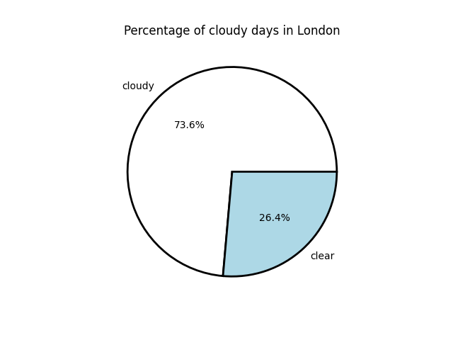
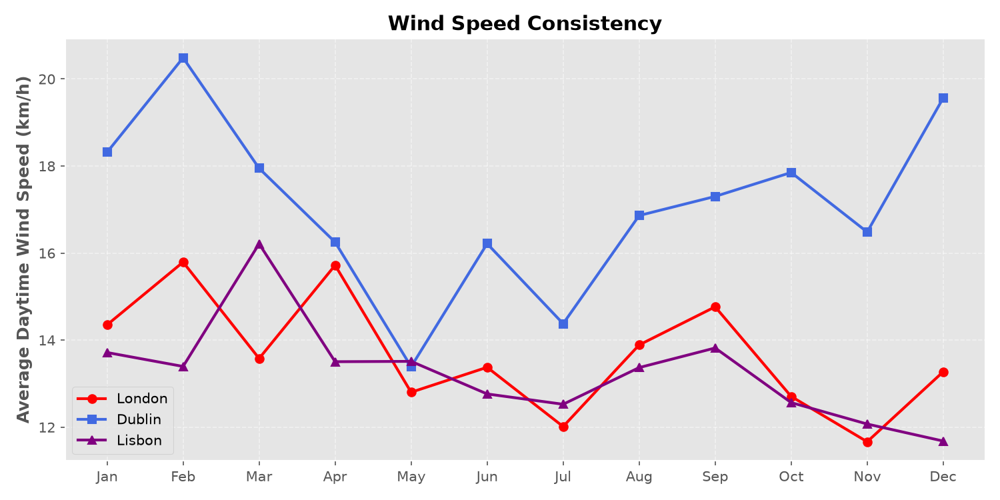
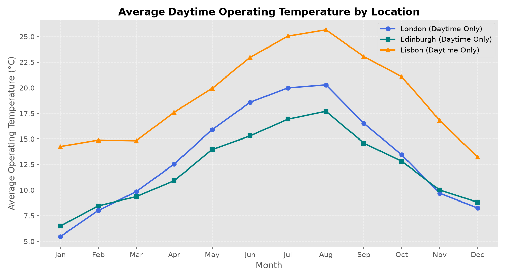
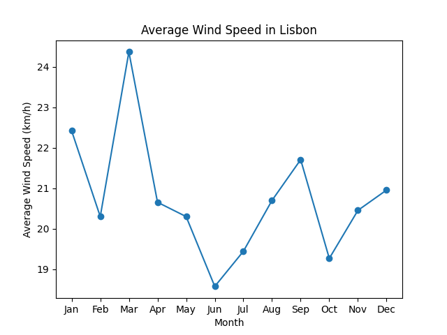
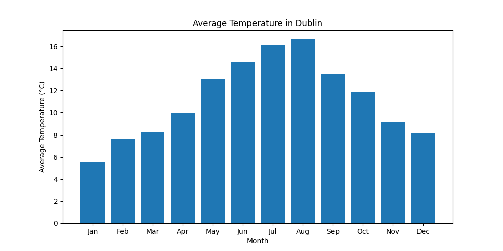
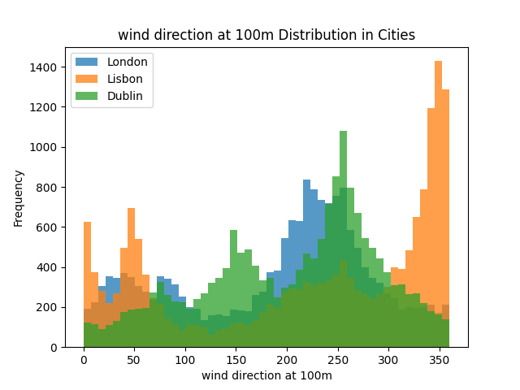

# STFC Scientific Computing Department Online Work Experience

This repository was produced as part of a week-long online work experience programme run by the STFC Scientific Computing Department at Daresbury Laboratory, Warrington. During the week, 4 A-level students gained practical experience in Scientific Computing by accessing a Linux server using SSH, finding and extracting data from `archive.tar.gz`, and performing data analysis on weather data using Python.

## What the students accomplished

Students completed a comprehensive data analysis project that involved:

- Finding and extracting datasets from an archive using a CLI.
- Implementing data analysis pipelines using Python, Pandas and Matplotlib notebooks
- Using git to manage version control between collaborators.
- Worked as a team to manage their workload and deliver a presentation answering their research questions.

During this placment the students gained technical skills using tools like Python, Pandas, Matplotlib, Linux CLI, grep, git and vim,

## Solar Energy Analysis

The Solar Energy team set out to answer the question **Which city has the best weather conditions for Solar Energy?**. 

To achieve this they carried out independent research on factors impacting Solar Panels, performed exploratory data analysis and produced figures evidencing their conclusions.

A few example figures can be seen below:

  
  
  

## Wind Energy Analysis

The Wind Energy team set out to answer the question **Which city has the best weather conditions for Wind Energy?**. 

To achieve this they carried out independent research on factors impacting Wind turbines, performed exploratory data analysis and produced figures evidencing their conclusions.

A few example figures can be seen below:

  
  
  

